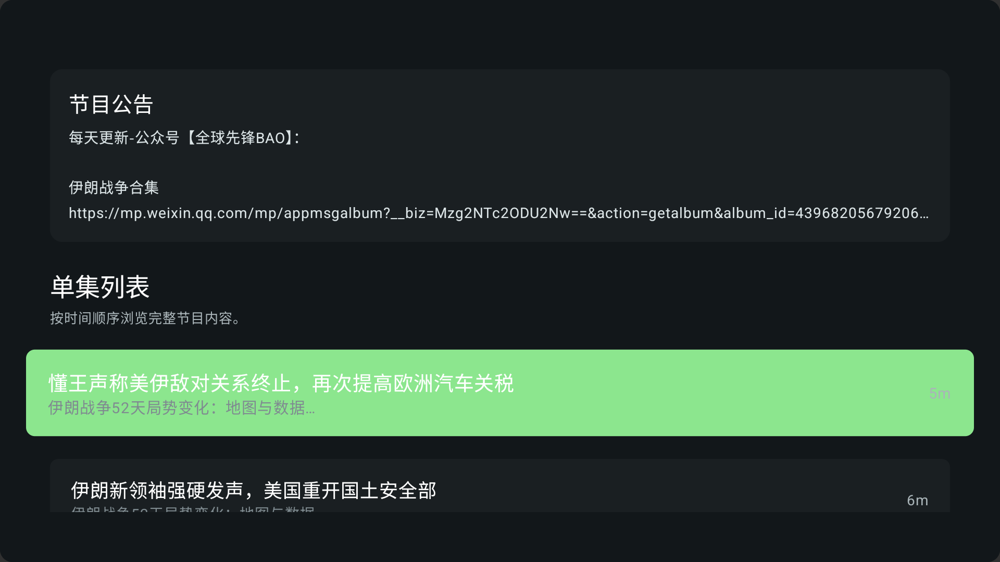
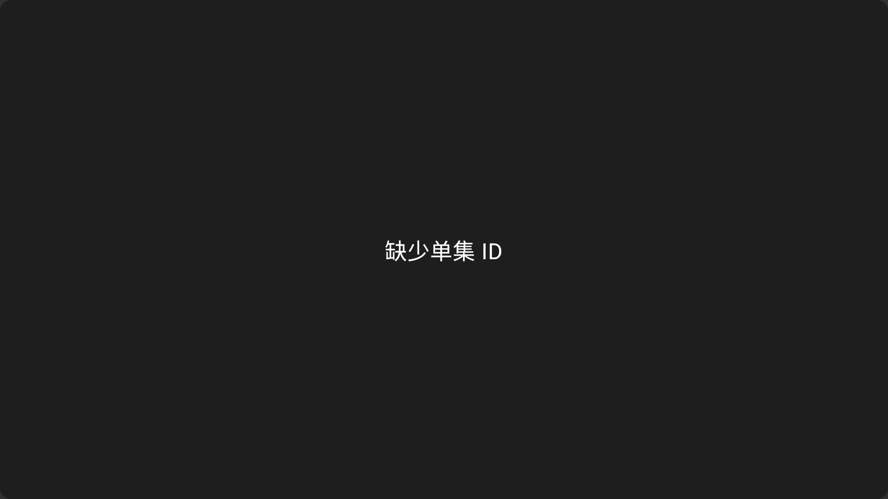
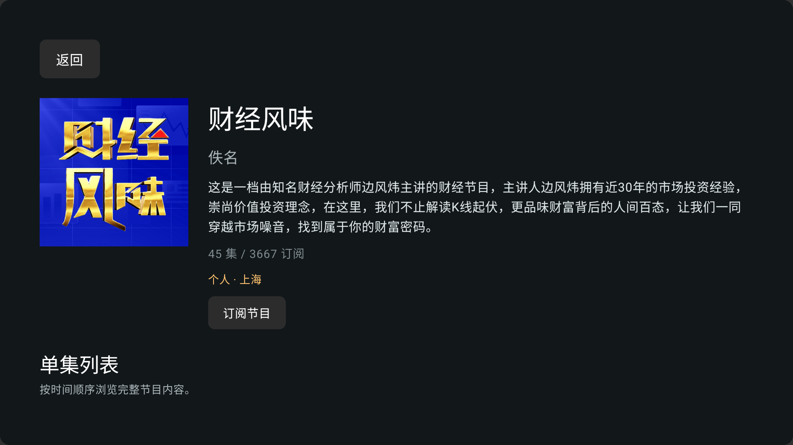
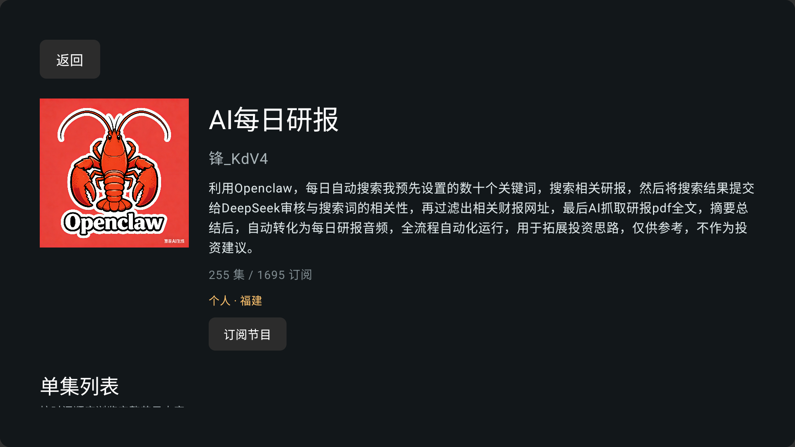
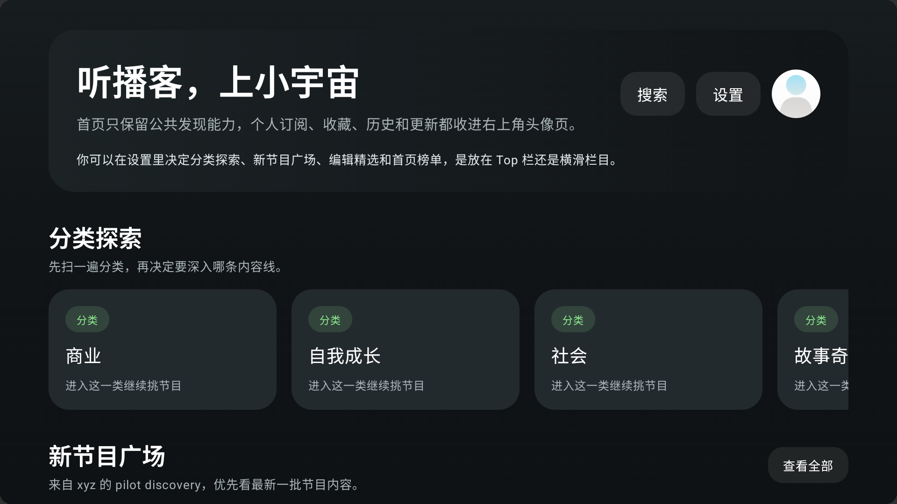

# 小宇宙 TV (XYZ TV)

<p align="center">
  <strong>🎧 小宇宙播客 Android TV 客户端</strong>
  <br>
  <sub>专为大屏打造的沉浸式播客收听体验</sub>
</p>

<p align="center">
  
  
  
</p>

---

## 简介

**小宇宙 TV** 是一款专为 Android TV 和电视盒子打造的第三方「小宇宙播客」客户端。基于 Jetpack Compose for TV 构建，针对遥控器操作和电视大屏进行了深度优化，提供沉浸式的播客收听体验。

> ⚠️ **本项目仅供学习、研究使用，所有数据版权归属 [小宇宙 FM](https://www.xiaoyuzhoufm.com/)，请遵守相关法律法规。**

## 功能特性

### 核心功能
- **播客发现**：首页推荐、榜单（最热榜、锋芒榜、新星榜）、编辑精选、大家都在听
- **节目订阅**：查看订阅列表、星标订阅管理、订阅/取消订阅
- **内容搜索**：搜索节目、单集和用户，智能搜索建议
- **分类浏览**：完整的分类体系与标签筛选
- **播放控制**：沉浸式全屏播放器、播放进度、倍速播放（0.75x ~ 3x）、快进快退 30 秒
- **收听历史**：完整的历史记录回溯
- **个人主页**：收听统计、收藏单集、评论管理

### TV 专属优化
- 🎮 **遥控器导航**：DPAD 全键盘适配，焦点自动吸附
- 🎨 **暗色/亮色主题**：全局主题切换，适配不同观影环境
- 📺 **大屏布局**：无 Hero Banner 的 Shelf 式首页，信息密度合理
- 🖼️ **自适应图标**：Android TV 自适应图标与 Banner

## 界面预览

| 首页 | 播放界面 | 播客详情 |
|------|----------|----------|
|  |  |  |

| 节目详情 | 分类浏览 | 个人主页 |
|----------|----------|----------|
|  |  |  |

## 技术栈

| 层级 | 技术 |
|------|------|
| **UI 框架** | Jetpack Compose for TV (tv-material3) |
| **架构** | MVVM + ViewModel + StateFlow |
| **网络请求** | Retrofit + OkHttp + Gson |
| **音频播放** | ExoPlayer (Media3) |
| **图片加载** | Coil |
| **导航** | Jetpack Navigation Compose |
| **后端** | Go 服务 (嵌入式 / 独立部署) |

## 构建与运行

### 前置条件
- Android Studio Hedgehog (2023.1.1) 或更高版本
- JDK 17
- Android SDK API 34
- Go 1.22.0（如需独立运行后端服务）

### 编译 APK

```bash
# 克隆仓库
git clone https://github.com/你的用户名/xyz-tv.git
cd xyz-tv

# 编译 Debug 版本
./gradlew assembleDebug

# 输出路径
# app/build/outputs/apk/debug/app-debug.apk
```

### 安装到电视 / 模拟器

```bash
# 通过 ADB 安装到 Android TV 设备
adb install app/build/outputs/apk/debug/app-debug.apk

# 启动应用
adb shell am start -n com.ultrazg.xyztv/.MainActivity
```

## 使用教程

### 初次使用：网页登录

小宇宙 TV 需要通过官方网页登录获取授权 Token，**无需输入账号密码到本应用**。

#### 登录步骤

1. **打开登录页面**  
   启动应用后选择「网页登录」，应用会内置加载小宇宙官方登录页面：
   ```
   https://accounts.xiaoyuzhoufm.com/login
   ```

2. **自动切换到扫码登录**  
   页面加载完成后，应用会自动将登录方式切换为「扫码登录」Tab，此时屏幕会显示一个 **二维码**。

3. **手机扫码授权**  
   打开手机上已登录小宇宙的 App，使用扫一扫功能扫描电视屏幕上的二维码，确认登录。

4. **自动完成登录**  
   扫码成功后，应用会自动捕获授权 Token 并完成登录，随后进入首页。整个过程无需手动输入任何账号信息。

> 💡 **提示**：如果二维码未自动显示，可点击「刷新」按钮重新加载页面。登录状态会在应用内持久保存，下次打开无需重新登录。

### 遥控器操作指南

| 按键 | 功能 |
|------|------|
| **方向键 (DPAD)** | 导航移动焦点 |
| **确认键 (OK/Enter)** | 打开/播放/确认 |
| **返回键 (Back)** | 返回上一级 |
| **菜单键 (Menu)** | 打开播放器控制菜单 |
| **快进/快退** | 播放器中前进/后退 30 秒 |

### 主要界面说明

- **首页**：左侧边栏导航（首页/搜索/订阅/分类/历史/我的/设置），右侧内容 Shelf
- **播放器**：全屏沉浸，显示播客封面、播放进度、精彩时间点、评论、控制按钮
- **播客详情**：节目信息、单集列表、相关推荐
- **个人主页**：收听统计、我的收藏、我的评论、我的订阅

## 后端服务

应用内置了嵌入式 Go 后端服务（`embeddedxyz.aar`），开箱即用。如需独立部署后端或二次开发：

```bash
# 独立后端仓库（见下方「引用」）
go get github.com/ultrazg/xyz

# 启动服务（默认端口 23020）
go run . -p 23020
```

## 致谢

本项目 TV 端的界面设计与交互方向深受 **SmartTube** 的启发，感谢 SmartTube 团队为 Android TV 应用树立了极佳的交互范式。

- [SmartTube](https://github.com/yuliskov/smarttube) — 优秀的 Android TV 开源项目，界面简洁、遥控器操作流畅

## 引用

本项目的后端 API 数据层基于以下开源项目构建：

- [xyz](https://github.com/ultrazg/xyz) — 小宇宙 FM API Go 封装，提供了完整的数据接口与登录鉴权能力

## 免责声明

**⚠️ 本项目仅供学习、研究使用，请遵守国家法律，严禁用于任何非法用途。**

- 本项目所有播客内容、封面图片、音频数据均来自 [小宇宙 FM](https://www.xiaoyuzhoufm.com/)，版权归原平台及创作者所有。
- 本项目不存储任何音频文件或用户数据，仅作为客户端展示层。
- 使用本项目产生的任何风险与责任由使用者自行承担。

## License

本项目基于 [MIT License](LICENSE) 开源。

---

<p align="center">
  Made with ❤️ for podcast lovers on the big screen.
</p>
